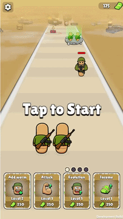
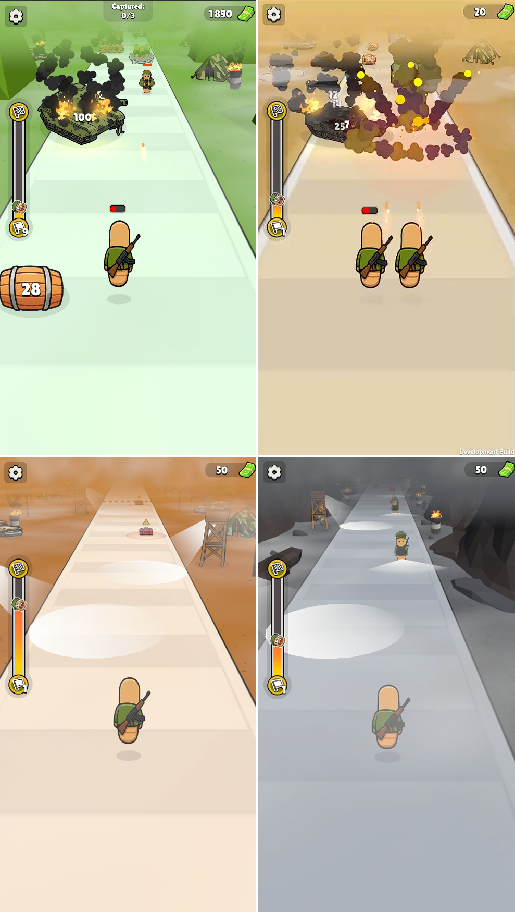

# Worm Runner

**Genre:** Action Runner
**Status:** Frozen at demo stage (2025)

A military-themed runner where the player commands a swarm of combat worms moving forward through a level — collecting money, destroying enemies, and overcoming obstacles.

## Why I made this project

I wanted to understand how classic runner games are built under the hood — swarm mechanics, progression, and gameplay variety.

## Gameplay

  

## Screenshots

  

## Key Mechanics
- Dynamic swarm
- Worm evolution
- Multiple game modes (classic runner, stealth, defense, object collection, zone capture)
- Interactive objects: buff/debuff gates, enemies, mines, spawn incubators, bonus chests

## Tech Stack
- Unity
- ECS Morpeh
- UniTask
- GamePush SDK (web platform integration)

---

The project was stopped at the demo stage. Source code is released for archival/educational purposes.

MIT License

Copyright (c) 2025 xtrayssss

Permission is hereby granted, free of charge, to any person obtaining a copy
of this software and associated documentation files (the "Software"), to deal
in the Software without restriction, including without limitation the rights
to use, copy, modify, merge, publish, distribute, sublicense, and/or sell
copies of the Software, and to permit persons to whom the Software is
furnished to do so, subject to the following conditions:

The above copyright notice and this permission notice shall be included in all
copies or substantial portions of the Software.

THE SOFTWARE IS PROVIDED "AS IS", WITHOUT WARRANTY OF ANY KIND, EXPRESS OR
IMPLIED, INCLUDING BUT NOT LIMITED TO THE WARRANTIES OF MERCHANTABILITY,
FITNESS FOR A PARTICULAR PURPOSE AND NONINFRINGEMENT. IN NO EVENT SHALL THE
AUTHORS OR COPYRIGHT HOLDERS BE LIABLE FOR ANY CLAIM, DAMAGES OR OTHER
LIABILITY, WHETHER IN AN ACTION OF CONTRACT, TORT OR OTHERWISE, ARISING FROM,
OUT OF OR IN CONNECTION WITH THE SOFTWARE OR THE USE OR OTHER DEALINGS IN THE
SOFTWARE.
